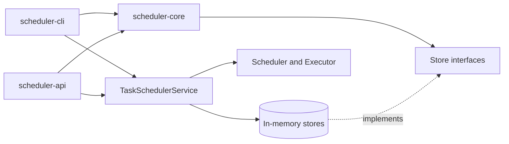

# Task Scheduler

A learning project that implements a multi-threaded task scheduler in Java. It supports one-time and recurring tasks, a manually managed worker pool, pluggable persistence contracts, an interactive CLI, and an early Spring Boot API.

## Modules

| Module           | Responsibility                                                                          |
| ---------------- | --------------------------------------------------------------------------------------- |
| `scheduler-core` | Domain models, scheduling engine, shared application service, and persistence adapters |
| `scheduler-cli`  | Interactive terminal client built on the shared scheduler service                      |
| `scheduler-api`  | Spring Boot API for creating tasks and reading task and execution state                |

Each module has its own README with its internal structure and behavior.

## Architecture



The core module does not choose a database or storage technology. Applications create implementations of `TaskStore`, `TaskScheduleStore`, and `TaskExecutionStore`, then inject them into the scheduler and executor.

## Execution Flow

1. A client creates a `Task` and its `TaskSchedule`.
2. A `TaskExecution` is added to the scheduler's time-ordered queue.
3. The scheduler waits until the earliest execution is due.
4. Due executions are passed to the executor queue.
5. A worker loads the task from `TaskStore`, runs it, and records the result through `TaskExecutionStore`.
6. For a recurring schedule, the scheduler creates the next execution using the configured interval.

## Project Structure

```text
task-scheduler/
|-- scheduler-core/   # Engine, shared service, storage contracts, and in-memory stores
|-- scheduler-cli/    # Interactive CLI application
|-- scheduler-api/    # Spring Boot API and composition configuration
`-- pom.xml            # Parent Maven reactor
```

## Build

Requirements:

- JDK 21
- Maven 3.9 or newer

Build and test all modules from the repository root:

```bash
mvn clean test
```

The project currently has no automated test sources, so this command validates dependency resolution and compilation for all modules.

## Current Status

Both the CLI and API compose the same core scheduling service. Persistence is currently in memory, so tasks and execution history are reset whenever an application process restarts.
