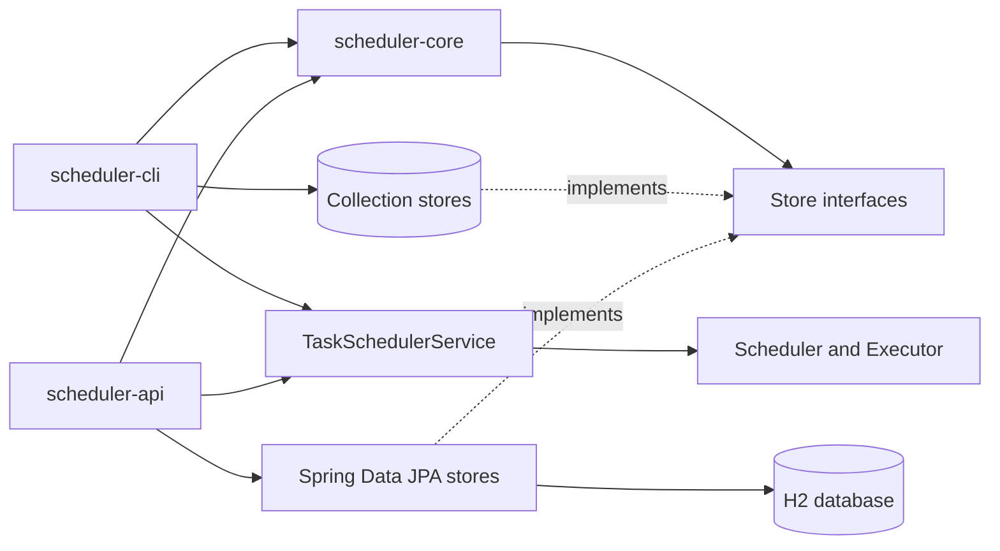

# Task Scheduler

A learning project that implements a multi-threaded task scheduler in Java with a React user interface. It supports one-time and recurring tasks, a manually managed worker pool, pluggable persistence contracts, an interactive CLI, and a Spring Boot API.

## Modules

| Module           | Responsibility                                                                         |
| ---------------- | -------------------------------------------------------------------------------------- |
| `backend/scheduler-core`      | Domain models, scheduling engine, shared application service, and persistence adapters |
| `backend/scheduler-cli`       | Interactive terminal client built on the shared scheduler service                      |
| `backend/scheduler-api`       | Spring Boot API for creating tasks and reading task and execution state                |
| `frontend/scheduler-ui`       | React interface for creating tasks and viewing task executions                         |

Each module has its own README with its internal structure and behavior.

## Architecture



The core module does not choose a database or storage technology. Applications create implementations of `TaskStore`, `TaskScheduleStore`, and `TaskExecutionStore`, then inject them into the scheduler service with the required worker count. The CLI starts 5 workers, while the API starts 10.

## Execution Flow

1. A client creates a `Task` and its `TaskSchedule`.
2. A `TaskExecution` is added to the scheduler's time-ordered queue.
3. The scheduler waits until the earliest execution is due.
4. Due executions are passed to the executor queue.
5. A worker loads the task from `TaskStore`, runs it, and records the result through `TaskExecutionStore`.
6. For a recurring schedule, the scheduler creates the next execution using the configured interval.

## Project Structure

```text
task-scheduler/
|-- backend/
|   |-- scheduler-core/   # Engine, shared service, storage contracts, and in-memory stores
|   |-- scheduler-cli/    # Interactive CLI application
|   |-- scheduler-api/    # Spring Boot API and composition configuration
|   `-- pom.xml           # Parent Maven reactor
`-- frontend/
    `-- scheduler-ui/     # React and Vite web application
```

## Build

Requirements:

- JDK 21
- Maven 3.9 or newer
- Node.js 20.19 or newer

Build and test all backend modules:

```bash
cd backend
mvn clean test
```

Build the frontend:

```bash
cd frontend/scheduler-ui
npm install
npm run build
```

The API module includes an H2-backed Spring end-to-end test that exercises task creation, queries, state transitions, execution persistence, and task subtype payloads.

## Current Status

Both the CLI and API compose the same core scheduling service. The CLI uses collection-backed stores, while the API uses Spring Data JPA with H2. The configured H2 database is in-memory, so API data is reset when the process restarts; the JPA adapters can also be used with a durable database configuration.

WRITE and DELETE tasks operate directly on their configured file paths. They do not coordinate access with a shared file lock, so concurrently scheduled operations on the same path have nondeterministic ordering. Their current implementations also handle I/O exceptions internally, which means an execution can be recorded as completed even when its file operation fails.
