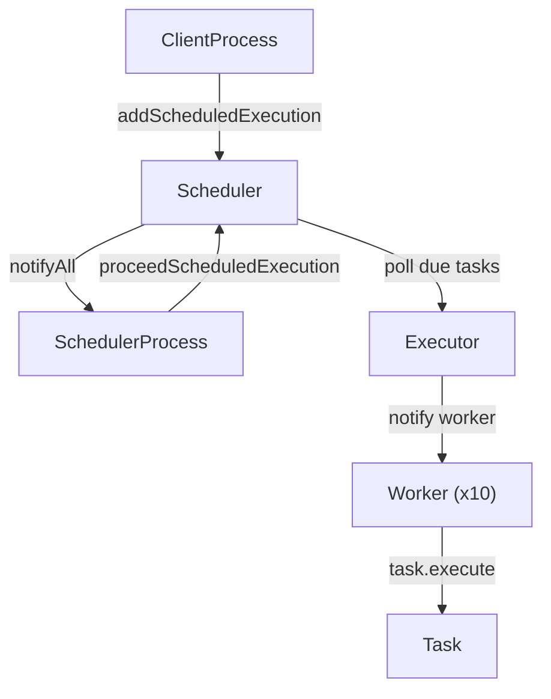

# Task Scheduler

A multi-threaded task scheduler in Java — supports one-time and recurring task execution with a thread pool executor.

---

## Flow

---

## Components

| Class                | Role                                                              |
| -------------------- | ----------------------------------------------------------------- |
| `Scheduler`          | Priority queue of upcoming executions; wakes up at the right time |
| `SchedulerProcess`   | Thread that triggers `proceedScheduledExecution` when due         |
| `Executor`           | Dispatches due tasks to a pool of Worker threads                  |
| `Worker`             | Waits on shared queue, picks up and runs tasks                    |
| `ClientProcess`      | Simulates adding tasks at runtime                                 |
| `TaskSchedule`       | Holds task + start time + recurrence config                       |
| `ScheduledExecution` | A concrete execution instance with a timestamp                    |

---

## Multithreading Concepts

### Used here

| Concept                              | Where                                                                       |
| ------------------------------------ | --------------------------------------------------------------------------- |
| `synchronized` methods/blocks        | `Scheduler`, `Executor` — protect shared queues                             |
| `wait()` / `notifyAll()`             | Scheduler sleeps until next task is due; workers sleep until queue has work |
| Timed `wait(millis)`                 | Scheduler sleeps exactly until the next execution time                      |
| Manual thread pool                   | `Executor` spawns N `Worker` threads sharing one queue                      |
| `Runnable` + `Thread`                | `SchedulerProcess`, `ClientProcess`, `Worker`                               |
| `Thread.currentThread().interrupt()` | Restores interrupt flag on `InterruptedException`                           |

### Related — good to know

| Concept                       | What it does                                                                              |
| ----------------------------- | ----------------------------------------------------------------------------------------- |
| `BlockingQueue`               | Built-in thread-safe queue with blocking `take()` — replaces manual wait/notify in Worker |
| `ReentrantLock` / `Condition` | More flexible alternative to `synchronized` + `wait/notify`                               |
| `ScheduledExecutorService`    | Java built-in that does exactly what this project does — good reference                   |
| `volatile`                    | Ensures variable visibility across threads without full sync                              |
| `AtomicInteger`               | Lock-free thread-safe counter                                                             |
| `CountDownLatch`              | Wait for N threads to finish before proceeding                                            |
| `CyclicBarrier`               | Sync point where N threads all wait for each other                                        |
