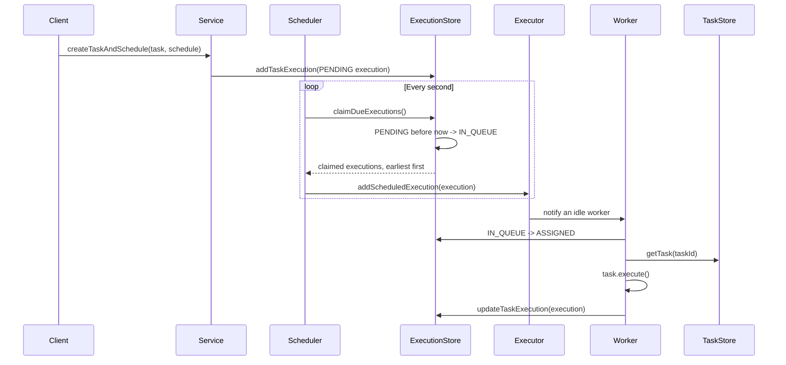

# Scheduler Core

`scheduler-core` contains the framework-independent scheduling engine. It defines the task domain, coordinates execution timing, runs tasks on worker threads, and exposes storage interfaces without depending on a specific persistence technology.

## Package Structure

```text
com.nayan.scheduler.core
|-- factory/   # Creates concrete task types
|-- engine/    # Scheduler, executor, and workers
|-- model/     # Tasks, schedules, and execution records
|-- service/   # Shared task scheduling use cases
|-- store/     # Persistence contracts and in-memory implementations
`-- util/      # Console logging helper
```

## Domain Model

- `Task` is the base type for executable work and contains its ID, name, status, and schedule ID.
- `PrintTask`, `WriteTask`, and `DeleteTask` implement the actual operations.
- `TaskSchedule` stores the start time, recurrence flag, and recurrence interval for a task.
- `TaskExecution` represents one scheduled attempt and tracks its execution time, worker, and status.
- `TaskFactory` is the creation entry point for the supported task types.

A task and an execution are separate objects. One recurring task keeps one schedule but produces many execution records.

## Scheduling Flow



`Scheduler` has no queue or next-wakeup calculation. `SchedulerProcess` polls once
per second (a slow poll can delay subsequent polls). The store owns ordering and
atomically claims up to 100 executions whose status is PENDING and whose execution time is
**strictly before** its captured `Instant.now()`. Exactly-now executions wait until
the next poll. The records are changed to IN_QUEUE before being returned. Any
remaining due PENDING executions stay available for subsequent polls.

`TaskExecutionIMStore` keeps a priority queue of PENDING records and synchronizes
claims and mutations. It returns snapshots so callers cannot change stored state
or corrupt queue ordering without a store update. The JPA adapter uses a single
H2 update-and-return statement to claim and read the batch; it does not maintain
a Java priority queue or update executions one by one.

When an execution becomes due:

1. The store changes it from PENDING to IN_QUEUE.
2. The scheduler forwards it to `Executor`.
3. The executor checks task state; inactive tasks have waiting executions discarded.
4. `TaskExecutionPlanner` supplies the next recurring occurrence, persisted by the executor.
5. One-time task status is still marked completed at dispatch, preserving the existing policy.
6. The worker claims IN_QUEUE as ASSIGNED before running the task.

Execution creation is shared by the service (initial/resumed runs) and executor
(recurring runs) through `TaskExecutionPlanner`. It retains the existing
`now + interval` timing policy rather than backfilling missed schedule intervals.

## Worker Pool

`Executor` starts the number of `Worker` threads supplied to `TaskSchedulerService`.
All workers share one synchronized FIFO queue. A worker removes an execution under
the queue lock, then claims it in the store outside that lock. Rejected claims
(for example, a cancelled IN_QUEUE record) are logged and skipped without ending
the worker. After a successful claim, its local worker ID/status are refreshed
before completion is saved.

The worker threads are daemon threads. They do not keep the JVM alive after all normal application threads have ended.

## Application Service

`TaskSchedulerService` is the shared entry point used by the CLI and API. It creates and starts the engine, stores tasks and schedules, and exposes operations to create, cancel, pause, resume, and query tasks. Keeping these use cases in core prevents each application module from rebuilding the orchestration flow.

Pause and cancel update the task state and discard PENDING and IN_QUEUE execution
records, not already ASSIGNED work. Resume is valid only for a paused task; it
reactivates the task and persists a new PENDING execution for the next poll.

## Deferred Recovery

Automatic startup and stale-worker recovery are outside the current scope.
`startScheduler()` only starts polling PENDING executions. Existing IN_QUEUE and
ASSIGNED records are not reset to PENDING, including after an application restart.

Store updates and executor enqueueing are not one transaction. A dispatch failure
is logged, the remaining batch is still attempted, and undelivered IN_QUEUE records
remain IN_QUEUE without automatic retry. Work interrupted while ASSIGNED is also
not automatically retried. Persistence preserves those records, but does not
guarantee delivery after a crash. Ownership, duplicate-execution protection, and
retry behavior for one-time and recurring tasks need a separate recovery design.

## Persistence Contracts

The `store` package defines three ports:

| Interface            | Stores                                  |
| -------------------- | --------------------------------------- |
| `TaskStore`          | Task definitions and task status        |
| `TaskScheduleStore`  | Start time and recurrence configuration |
| `TaskExecutionStore` | Individual execution history and status |

The `store.inmemory` package provides collection-backed implementations used by the CLI. The API implements the same contracts with Spring Data JPA. Other applications can provide files, JDBC, or another database without changing the scheduling engine.

## Using the Core

An application composes the engine in this order:

1. Create implementations of all three store interfaces.
2. Construct `TaskSchedulerService` with those stores and a positive worker count.
3. Call `startScheduler()` once during application startup.
4. Use the service to create tasks and manage their state.

The CLI and API modules provide plain Java and Spring examples of this composition. They currently configure 5 and 10 workers, respectively.

## File Task Concurrency

`WriteTask` appends through `FileWriter`, while `DeleteTask` calls `Files.deleteIfExists`. These operations use no shared path-level lock, so multiple workers can write and delete the same file concurrently and the final state depends on execution order. Both task types currently catch I/O exceptions inside the task, preventing `Worker` from marking those operations as failed.
