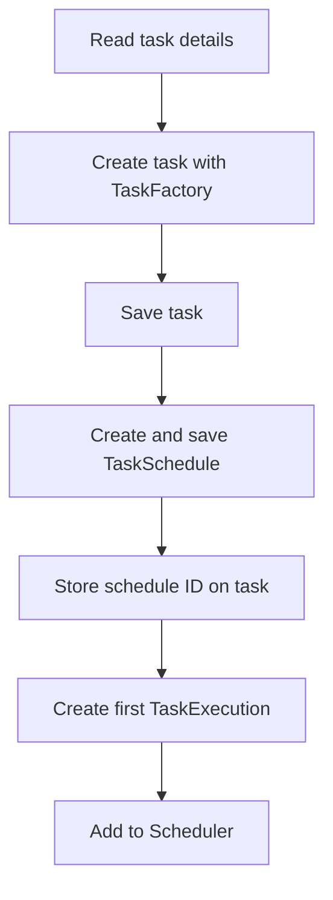

# Scheduler CLI

`scheduler-cli` is the runnable terminal application. It composes the core scheduling engine with in-memory stores and provides commands for creating and managing tasks.

## Composition

`Main` creates one instance of each in-memory store:

- `TaskIMStore`
- `TaskScheduleIMStore`
- `TaskExecutionIMStore`

It injects those stores into a five-worker `Executor`, a `Scheduler`, and the interactive `Client`. The application then starts two top-level threads:

| Thread | Purpose |
| --- | --- |
| Client thread | Reads menu input and updates tasks and schedules |
| Scheduler thread | Waits for due executions and dispatches them |

The scheduler thread is a daemon. Selecting **Exit** ends the client thread, after which the JVM can stop the scheduler and worker daemon threads.

## CLI Operations

The menu supports:

1. Add a print, write, or delete task.
2. Cancel a task.
3. Pause a task.
4. Resume a task.
5. List tasks.
6. List tasks with their execution history.
7. Load demonstration tasks.
8. Exit.

Demo tasks are loaded when the client starts. They exercise one-time and recurring print, write, and delete behavior under the `temp` directory.

## Creating a Task



The scheduler records the execution immediately, even though a worker does not run it until its scheduled time.

## Task State Changes

- **Cancel** marks the task `DEACTIVE`. Future queued executions are skipped.
- **Pause** marks the task `PAUSE`. Future queued executions are skipped.
- **Resume** marks the task active and schedules a new execution at the current time when the original start time has passed.

The scheduler queue and execution history are not deleted when a task changes state. This keeps the history visible in the list-with-executions view.

## In-Memory Persistence

The classes in `com.nayan.scheduler.cli.store` implement the core store interfaces with Java collections. Their data exists only for the lifetime of the process and is lost when the CLI exits.

These adapters demonstrate why the interfaces live in `scheduler-core`: another application can provide database-backed adapters while reusing the same engine.

## Build and Run

Compile the CLI and its core dependency from the repository root:

```bash
mvn -pl scheduler-cli -am package
```

The repository's VS Code launch configuration can start `com.nayan.scheduler.cli.Main`. The application is interactive and expects input through the terminal.