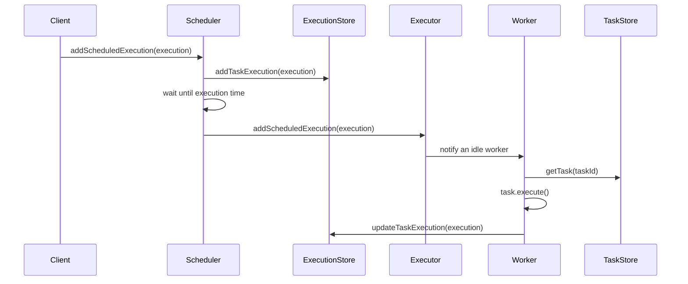

# Scheduler Core

`scheduler-core` contains the framework-independent scheduling engine. It defines the task domain, coordinates execution timing, runs tasks on worker threads, and exposes storage interfaces without depending on a specific persistence technology.

## Package Structure

```text
com.nayan.scheduler.core
|-- factory/   # Creates concrete task types
|-- model/     # Tasks, schedules, and execution records
|-- service/   # Scheduler, executor, and workers
|-- store/     # Persistence contracts implemented by an outer module
`-- util/      # Console logging helper
```

## Domain Model

- `Task` is the base type for executable work and contains its ID, name, status, and schedule ID.
- `PrintTask`, `WriteTask`, and `DeleteTask` implement the actual operations.
- `TaskSchedule` stores the start time, recurrence flag, and recurrence interval for a task.
- `TaskExecution` represents one scheduled attempt and tracks its execution time, worker, and status.
- `TaskFactory` is the creation entry point for the supported task types.

A task and an execution are separate objects. One recurring task keeps one schedule but produces many execution records.

## Scheduling Flow



`Scheduler` uses a `PriorityQueue` ordered by execution time. `waitUntilNextExecution()` performs a timed wait for the earliest item, while `addScheduledExecution()` calls `notifyAll()` so an earlier newly added execution can change that wait.

When an execution becomes due:

1. The scheduler loads its task from `TaskStore`.
2. Active tasks are submitted to `Executor`.
3. A recurring schedule produces its next `TaskExecution`.
4. A completed one-time task is marked completed.
5. Executions for inactive tasks are marked skipped.

## Worker Pool

`Executor` starts a fixed number of `Worker` threads. All workers share one synchronized FIFO queue. A worker waits while the queue is empty, removes an execution when notified, loads the associated task, executes it, and updates the execution record.

The worker threads are daemon threads. They do not keep the JVM alive after all normal application threads have ended.

## Persistence Contracts

The `store` package defines three ports:

| Interface            | Stores                                  |
| -------------------- | --------------------------------------- |
| `TaskStore`          | Task definitions and task status        |
| `TaskScheduleStore`  | Start time and recurrence configuration |
| `TaskExecutionStore` | Individual execution history and status |

The core module only calls these interfaces. An outer module can implement them with in-memory collections, files, JDBC, or another database without changing the scheduling engine.

## Using the Core

An application composes the engine in this order:

1. Create implementations of all three store interfaces.
2. Create an `Executor` with a worker count, task store, and execution store.
3. Create a `Scheduler` with the executor and all stores.
4. Run a loop that calls `waitUntilNextExecution()` followed by `processScheduledExecutions()`.
5. Create tasks, schedules, and initial executions through the application boundary.

The CLI module is the current reference composition.
